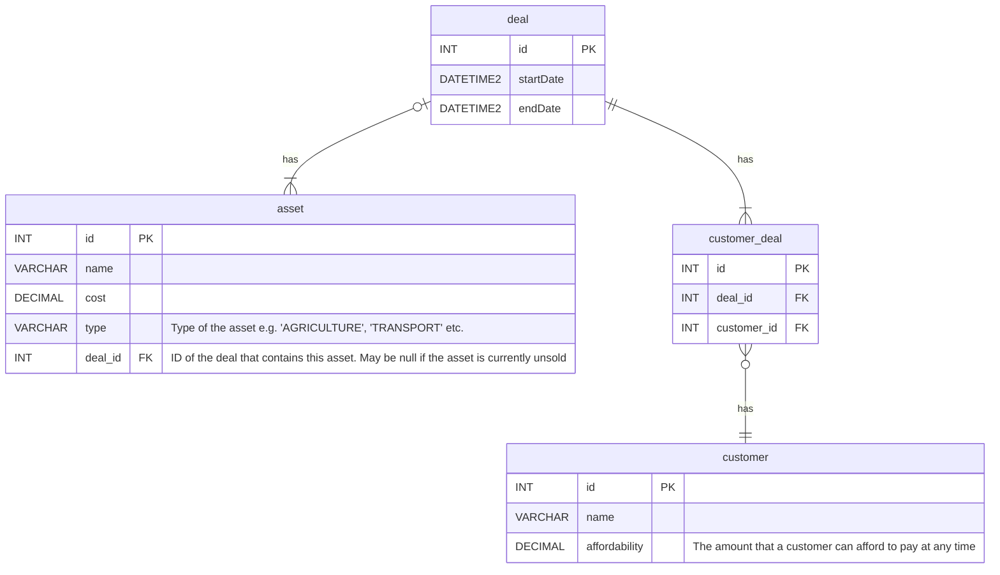

# Simply Asset Finance Coding Test
Welcome to the coding test for Simply Asset Finance.  Please read the description below to find out more about the format
of the test, and the project that you'll be working with.  

When you are ready to begin, make a fork of this repository (https://github.com/SimplyFinance/asset-recommender), make any
changes to the code as instructed and open a pull request pointing to `master` branch once you have completed the test.

Feel free to change anything you see fit about the project, including DB structure, the Dockerfile and the Maven config.
Refactoring of code is __heavily encouraged__, as you may notice some sub-optimality in code quality throughout.

# Asset Recommendation System

This project is a system that holds information about customers and any loans that they have taken out, and recommends
any assets to them that might be a good fit.

It is a Spring Boot (1.4) project, built using Maven (3.8.2), with a SQL Server database to persist information about customers,
assets and current loans, or deals.  A Dockerfile describing a simple DB image is provided as part of the project.  
This sets up the database structure, and adds a few records to the DB.

## DB Structure

A `deal` is a loan currently held by the system and has a start date and an end date, 
as well as some `asset`s and `customer`s associated with it.  A `deal` can have multiple assets of varying types, and
multiple `customer`s.

An asset is an item, usually a piece of machinery or a vehicle, that a customer can take out a loan for.

## Recommendations

We make a recommendation of an asset to a customer based on a few things:
- Firstly, the asset must be 'unsold'.  That is, it does not exist as part of any `deal`s (It's `deal_id` is `NULL`).
- The `type` of the asset is one that the customer has already taken a loan out for on a previous asset.  
i.e. If a customer has taken out a loan for an asset of type `CONSTRUCTION`, then we will only recommend assets with type 
`CONSTRUCTION`, and not of type `AGRICULTURE`, for example.
- The customer can afford the loan.  That is, the customer's `affordability` is greater than or equal to the current amount
that they are paying for all active loans.  The current amount a customer is paying for a single loan is calculated as the sum of 
the costs of all the assets associated with the loan, divided by the total number of customers that are associated to the loan.
e.g. if customer `A` currently has two active loans on a certain date for £10,000 each, one of which is split between them and another 
customer `B`, customer `A`'s current outgoings would be `10,000 + (10,000 / 2) = 15,000`.

The application contains a single endpoint that takes in a date value as query parameter, and returns a map of 
customer IDs to a list of assets that are recommended for them, on that date.

## Docker

In order to build and run the Docker image, navigate to `asset-recommender/src/main/resources` and run 

`docker run -it -p 127.0.0.1:1433:1433/tcp $(docker build -q .)`

## Maven

In order to build Spring Boot application, navigate to the base directory of the project (`asset-recommender`) and run 

`mvn clean install`

This will create a file called `asset-recommender.jar` in the `target` directory.  This file can be run as usual, simply 
by running 

`java -jar target/asset-recommender.jar`

## Task

You should make changes to the application to add a couple of features as detailed below:
- Firstly, there is a requirement to make the asset types more easily extensible.  Thus, instead of an enum as they are 
defined currently, you should create a separate table in the DB for them such that they can be added/removed at runtime.
- Secondly, there is a requirement to change the format of the endpoint response such that the recommendations are ordered
based on the likelihood that a customer will accept them.  Very naively, we say that a user is more likely to accept a 
recommendation if the gap between their current spare cash (that which is not tied up in active deals) and the cost of 
the asset is larger.  You are free to choose this format as you see fit.

## JUnit Tests

There currently exists one test class in the project, `RecommendationControllerIT`, containing a few tests to verify that
the endpoint works as expected.  These are written using JUnit version 4.12.

Please update these tests to work after you have made the changes, and feel free to add any more as you see fit.
