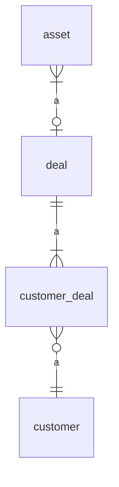

# Asset Recommendation System

This project is a system to recommend assets to a customer based on a couple of metrics.

An asset is an item, usually a piece of machinery or a vehicle, that a customer can take out a loan for.

The system is backed by a SQL Server database that keeps track of a few things. The DB structure is:

## Docker

From `asset-recommender/src/main/resources` run `docker run -it -p 127.0.0.1:1433:1433/tcp $(docker build -q .)`

## Maven

From `asset-recommender` run `mvn clean install` to build app.

Then run `java -jar target/asset-recommender.jar` to run app